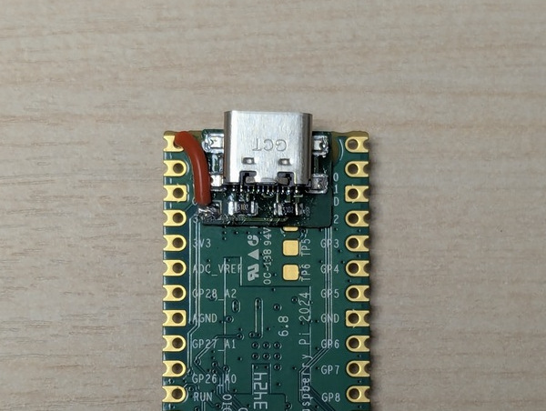
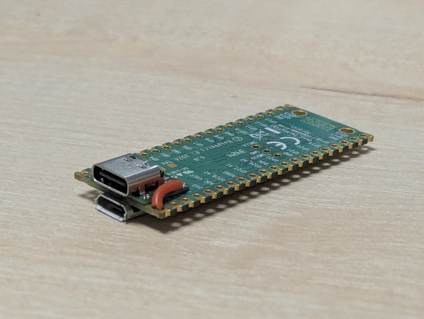

Raspberry Pi Pico USB-C Mod
===

This repository contains an adapter board for RPI Pico USB-C mod.
It should be compatible with all versions of RPI Pico family (Pico, Pico W, Pico W, Pico WH, Pico 2, Pico 2 W), 
although I've designed to mod a Pico 2 W.

## BOM

* The adapter board PCB
* GCT USB4110-GF-A
* 51k Ohm 0805 resistors x2 
* Some wires

## How to build

### Make the PCB

You somehow need to make the adapter board PCB.
I've ordered through [JLCPCB](https://jlcpcb.com/). The thickness was 0.8mm.

### Solder the board

Then solder the adapter board PCB on the back of the RPI Pico.
Three pads on the adapter board should align with the RPI Pico's three pads (TP1, TP2, TP3).
It's easier to use a hot plate and solder paste.

### Solder the USB-C port

Next, solder the USB-C port on the adapter board.
It's easier to hand-solder with solder paste.

### Wire the VBUS

Finally, wire the remaining pad on the bottom-left side of the adapter board to the VBUS pin of the Raspberry Pico.